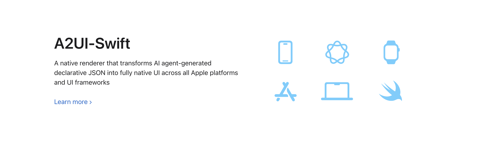

<div align="center">

# A2UI-Swift

**Render AI-generated JSON as safe native Apple UI.**



[](https://swift.org)
[](#requirements)
[](#installation)
[](https://bbc6bae9.github.io/a2ui-swift/documentation/)
[](https://github.com/a2ui-project/a2ui)
[](LICENSE)
[](https://github.com/BBC6BAE9/a2ui-swift/stargazers)

</div>

AI agents are getting good at deciding what interface a user needs next: a form, an approval card, a search result list, a booking panel, or a small workflow UI.

But shipping executable UI code from an agent into an iOS or macOS app is not a serious production boundary. Web views are easy to embed, but they often lose native behavior, accessibility, styling, and platform trust.

**A2UI-Swift** takes a different path:

```text
Agent -> declarative A2UI JSON -> A2UI-Swift -> SwiftUI / UIKit / AppKit
```

The agent describes **what** should be rendered. Your app keeps control of **how** it is rendered, which components are allowed, how actions are handled, and what data can flow back.

[A2UI](https://github.com/a2ui-project/a2ui) is an open protocol from Google for agent-to-user interfaces. **A2UI-Swift** is a community-maintained Apple-platform renderer, listed in the [official A2UI renderer ecosystem](https://a2ui.org/ecosystem/renderers/).

## Why This Exists

Modern AI apps need richer output than Markdown, but most options come with tradeoffs:

| Approach | Problem |
| --- | --- |
| Ask the model to generate SwiftUI code | Unsafe to execute and hard to review at runtime |
| Embed remote HTML in a web view | Easy to ship, but not truly native |
| Build one-off dynamic screens | Expensive to maintain across products |
| Hard-code every agent response | Safe, but too rigid for adaptive workflows |

A2UI-Swift is built for the middle ground: **agent-generated UI as data, rendered through trusted native controls**.

## What You Get

- **Native rendering across Apple platforms**: SwiftUI, UIKit, and AppKit renderers share one protocol model.
- **A2UI v0.9 / v0.9.1 support**: message processing, surfaces, data model updates, actions, expressions, checks, templates, and catalogs.
- **17 built-in components**: Text, Image, Icon, Button, TextField, CheckBox, Slider, ChoicePicker, DateTimeInput, Row, Column, List, Card, Tabs, Modal, Divider, AudioPlayer, and Video.
- **Two-way data binding**: inputs write back to the local data model, while streaming agent updates can rebuild or update the UI in place.
- **Custom component catalogs**: expose your own trusted SwiftUI, UIKit, or AppKit components to the agent without allowing arbitrary code execution.
- **Localization support**: ICU-backed number, currency, date formatting, and pluralization.
- **Test coverage**: 300+ tests across protocol decoding, expression evaluation, data binding, validation, and renderer behavior.

## Quick Start

### SwiftUI

```swift
import A2UISwiftUI

@State var viewModel = SurfaceViewModel(catalog: basicCatalog)

try viewModel.processMessages(messages)

A2UISurfaceView(viewModel: viewModel) { action in
    print("Action:", action.name)
}
```

### UIKit

```swift
import A2UISwiftCore
import A2UIUIKit

let hostView = A2UISurfaceHostView()

let processor = MessageProcessor(catalogs: [catalog]) { action in
    print("Action:", action.name)
}

processor.processMessages(messages)

if let surface = processor.model.getSurface(surfaceId) {
    hostView.render(surface: surface, rootComponentId: "root")
}
```

### AppKit

```swift
import A2UISwiftCore
import A2UIAppKit

let hostView = A2UISurfaceHostView()

let processor = MessageProcessor(catalogs: [catalog]) { action in
    print("Action:", action.name)
}

processor.processMessages(messages)

if let surface = processor.model.getSurface(surfaceId) {
    hostView.render(surface: surface, rootComponentId: "root")
}
```

## Installation

Add A2UI-Swift through Swift Package Manager:

```swift
dependencies: [
    .package(url: "https://github.com/BBC6BAE9/a2ui-swift", from: "0.3.0"),
]
```

Then import the renderer you need:

```swift
import A2UISwiftUI
import A2UIUIKit
import A2UIAppKit
```

## Requirements

| Platform | Minimum version |
| --- | --- |
| iOS / tvOS | 17.0 |
| macOS | 14.0 |
| watchOS | 10.0 |
| visionOS | 1.0 |

## Modules

The package is split into focused library products, so apps can depend only on the pieces they need.

| Module | Purpose |
| --- | --- |
| `A2UISwiftCore` | Shared protocol layer: schema, data model, catalogs, expressions, actions, and message processing |
| `A2UISwiftUI` | SwiftUI renderer through `A2UISurfaceView` and `SurfaceViewModel` |
| `A2UIUIKit` | UIKit renderer for iOS, tvOS, and visionOS through `A2UISurfaceHostView` |
| `A2UIAppKit` | AppKit renderer for macOS through `A2UISurfaceHostView` |
| `Primitives` | Shared primitive types such as `ChatMessage`, `Part`, `JSONValue`, and `ToolDefinition` |
| `v_08` | Deprecated v0.8 renderer kept for legacy sample compatibility |

Full API documentation is published with DocC:

[https://bbc6bae9.github.io/a2ui-swift/documentation/](https://bbc6bae9.github.io/a2ui-swift/documentation/)

## Built-In Components

| Category | Components |
| --- | --- |
| Content | Text, Image, Icon, AudioPlayer, Video |
| Layout | Row, Column, List, Card, Tabs, Divider, Modal |
| Input | Button, TextField, CheckBox, Slider, DateTimeInput, ChoicePicker |

Agents can only use components that your client exposes through a catalog. This keeps the runtime boundary explicit: the model can request UI, but your app decides what is allowed.

## Data Binding And Actions

A2UI-Swift supports the core interaction model needed for real agent workflows:

- surfaces can be created, updated, and deleted through A2UI messages;
- components can read from and write to the surface data model;
- expressions can format, validate, and derive values;
- checks can disable invalid actions before they are sent;
- templates can render repeated UI from arrays or dictionaries;
- user actions are resolved into structured client actions for your transport layer.

That means an agent can stream a form, update a list, validate input, and receive structured user intent without executing code inside your app.

## Custom Components

Most production apps already have their own design system. A2UI-Swift is designed for that.

Register custom components in a catalog, map A2UI properties to your native view, and keep all rendering logic inside your app:

```swift
let catalog = CustomComponentCatalog(
    catalogId: "com.example.travel",
    components: [
        HotelCardComponent(),
        FlightOptionComponent(),
        ApprovalSummaryComponent(),
    ]
)
```

Custom catalogs let agents compose with your trusted building blocks instead of inventing UI code.

## Sample Apps

### `travel_app`

An end-to-end generative AI sample that combines A2UI-Swift with custom components and real agent interactions. The A2A protocol client lives in [a2a-swift](https://github.com/BBC6BAE9/a2a-swift) and is consumed as a remote SwiftPM dependency.

### `sample_0.9`

Minimal side-by-side demos for the current renderer family:

- `samples/sample_0.9/A2UISwiftUIDemo`
- `samples/sample_0.9/A2UIUIKitDemo`
- `samples/sample_0.9/A2UIAppKitDemo`

Use these when you want to inspect how the same A2UI payload maps to SwiftUI, UIKit, and AppKit.

### `sample_0.8`

Legacy demo app for the deprecated v0.8 renderer. It includes static JSON examples, live A2A agent connections, an info inspector, and action logs.

| info | action log | genui |
| :---: | :---: | :---: |
|  |  |  |

## When To Use It

A2UI-Swift is a good fit when:

- your agent needs to return interactive UI, not just text;
- you want native Apple UI instead of remote HTML;
- your app needs an explicit security boundary between model output and rendered controls;
- you already have trusted components and want the agent to compose them;
- you are building workflows such as booking, approval, customer support, search, checkout, or internal tools.

It is probably not the right layer if all you need is a static chat transcript or a fully remote web app.

## Testing

```bash
swift test
```

## Roadmap

- Track the A2UI v1.0 specification as it stabilizes.
- Expand production-oriented UIKit and AppKit coverage.
- Improve large-list, diffing, and renderer performance paths.
- Add more real-world sample workflows.
- Explore Objective-C friendly adapters for existing UIKit codebases.

## Who Is Using It

A2UI-Swift is a community renderer listed in the official A2UI renderer ecosystem:

[https://a2ui.org/ecosystem/renderers/](https://a2ui.org/ecosystem/renderers/)

If you are evaluating or using A2UI-Swift in a project, feel free to open a pull request adding your app, demo, or integration note here.

## Contributing

Issues and pull requests are welcome, especially in these areas:

- new catalog components;
- renderer behavior fixes;
- spec conformance tests;
- sample apps;
- documentation for real integration scenarios.

## License

[MIT](LICENSE)

<div align="center">
<sub>Built for the <a href="https://github.com/a2ui-project/a2ui">A2UI</a> ecosystem and native Apple platforms.</sub>
</div>
